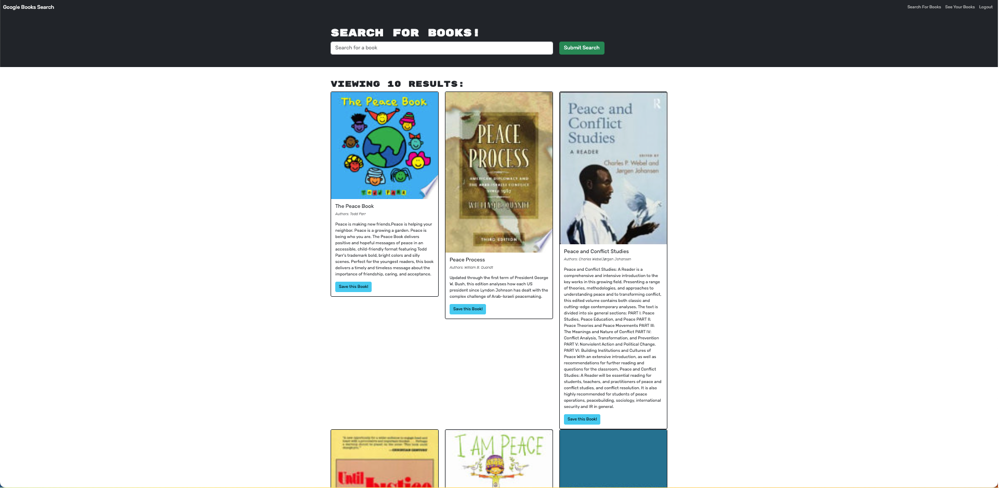

# Book Search Engine Starter Code
# Book Store Search

## Overview

Book Store Search is a web application that allows users to search for books and save their favorites. Built with React, Apollo Client, and GraphQL, it offers a seamless user experience for book enthusiasts.

## Features

- **Search Books**: Users can search for books by title, author, or keywords.
- **Save Books**: Users can save their favorite books for future reference.
- **User Authentication**: Secure user authentication using JWT tokens.
- **Responsive Design**: Optimized for both desktop and mobile views.

## Technologies Used

- React
- Apollo Client
- GraphQL
- Node.js
- Express.js
- MongoDB

## Setup and Installation

1. **Clone the Repository**
   
    git clone https://github.com/iphaminh/book-store-searc
    cd book-store-search
    npm install

2. **Set Up Environment Variables**
    Create a .env file in the root directory.

    MONGODB_URI=your_mongodb_uri
    SECRET_KEY=your_secret_key

3. **Run the Application**

    npm start

## Deployment

The application is deployed on Heroku. You can access it here.
https://book-store-search-62833e01409c.herokuapp.com/

## Contributing

Pull requests are welcome. For major changes, please open an issue first to discuss what you would like to change.

## License

MIT